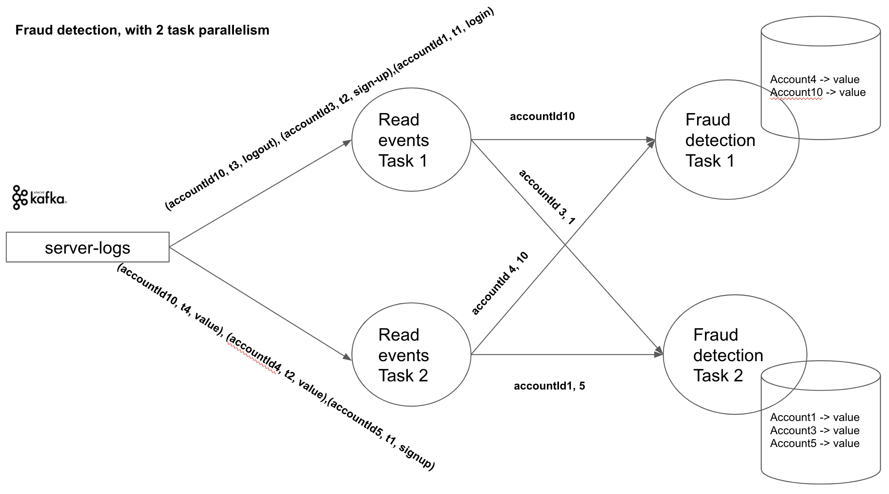

# Fraud Detection
Fraud detection system by analysing user account activity in real-time 

# Design

## Detection Logic 
For each serverLog event (remember it is being read in as a string of the format eventId,accountId,eventType,locationCountry,eventTimeStamp) I split the string using a comma and use the accountId as the key for the keyBy function which partitions the data stream by the accountId and sends events with the same accountId to the same task, this way I can ensure that the events generated by the same accountId always get sent to the same task. The task runs the FraudDetection logic .Also set up a FlinkKafkaProducer to push information about fraudulent logins into another Apache Kafka topic called alerts. WIe set the output from alerts to go to the alerts topic, using addSink.

# Data

The data will be generated by a data generation script at `src/main/scala/com.detection/ServerLogGenerator.scala`.

# Setup and run

```bash
docker-compose up -d # -d mean run in detached mode (in the background)
docker ps # display all running containers
```

password is `password`

```sql
select * from server_log limit 5; -- should match the first 5 from the server-logs topic
select count(*) from server_log; -- 100000
\q -- to exit pgcli
```

